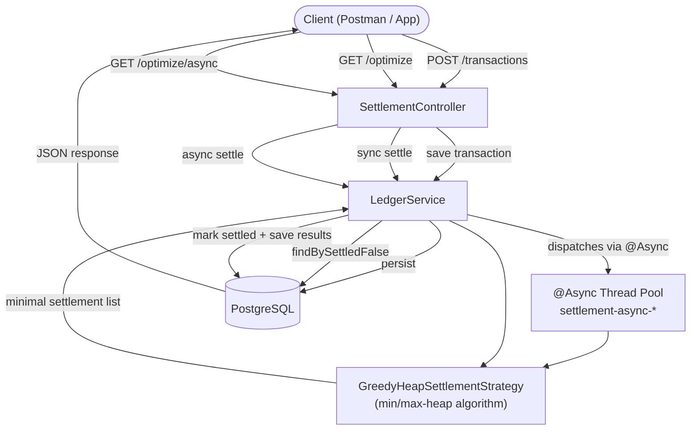
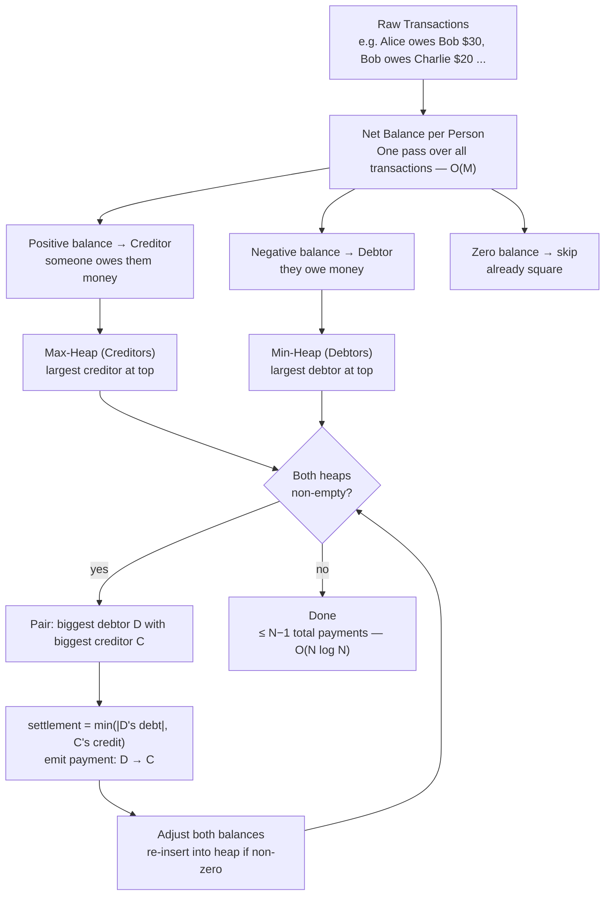

# Cash Flow Settlement Engine

A REST API that figures out the **minimum number of payments** needed to settle debts in a group — basically the backend logic of something like Splitwise.

The interesting part is the algorithm. If 6 people go on a trip and pay for different things, you can easily end up with 10+ debt relationships. This engine collapses all of that down to at most **N−1 payments** (where N is the number of people), which is the theoretical minimum.

---

## How it works — the big picture



---

## The algorithm — step by step

The core problem: given a messy web of who-owes-who, find the simplest way to clear everything.



**Why N−1 is the minimum:** you need at least one transaction per person to bring them to zero. With N people, that's N−1 edges in a spanning-tree sense. The heap approach guarantees this bound.

**Complexity:**
| Phase | Time |
|---|---|
| Balance aggregation | O(M) |
| Heap operations | O(N log N) |
| **Total** | **O(M + N log N)** |

---

## Tech stack

- Java 21 + Spring Boot 3
- Spring Data JPA + Hibernate + PostgreSQL
- `@Async` + `CompletableFuture` — settlement runs on a separate thread pool so the HTTP thread isn't blocked

---

## Project structure

```
src/main/java/com/cashflow/
├── api/
│   ├── SettlementController.java          # 3 REST endpoints
│   └── GlobalExceptionHandler.java        # JSON error responses
├── engine/
│   ├── SettlementAlgorithm.java           # interface (strategy pattern)
│   └── GreedyHeapSettlementStrategy.java  # the actual heap algorithm
├── entity/
│   ├── ExpenseTransaction.java            # main JPA table
│   └── UserNetBalance.java                # helper POJO for the algorithm
├── repository/
│   └── TransactionRepository.java
└── service/
    └── LedgerService.java
```

---

## Running it

```bash
# one-time setup
sudo -u postgres psql -c "ALTER USER postgres PASSWORD 'postgres';"
sudo -u postgres psql -c "CREATE DATABASE cashflow_db;"

./mvnw spring-boot:run
```

---

## API

```
POST  /api/v1/settlements/transactions    — add a debt record
GET   /api/v1/settlements/optimize        — run settlement (blocks until done)
GET   /api/v1/settlements/optimize/async  — run settlement (returns immediately)
```

**Quick example:**
```bash
curl -X POST http://localhost:8080/api/v1/settlements/transactions \
  -H "Content-Type: application/json" \
  -d '{"amount": 50.00, "description": "Dinner", "payerId": "aaaaaaaa-0000-0000-0000-000000000001", "payeeId": "bbbbbbbb-0000-0000-0000-000000000002"}'
```
